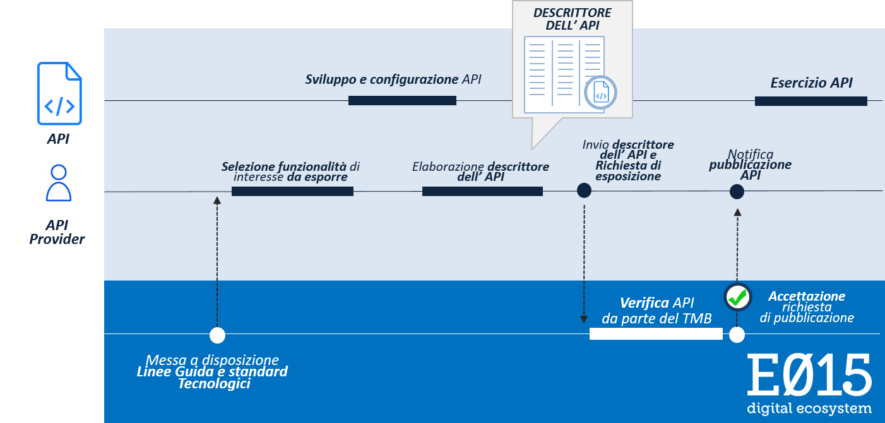

*************************************************************
Processo di pubblicazione delle API in E015 Digital Ecosystem
*************************************************************

.. raw:: html

  

  

Il presente documento indica le modalità operative e le Linee Guida tecnologiche che è necessario seguire al fine di poter pubblicare una API all’interno di E015 Digital Ecosystem.
La pubblicazione delle API all’interno di E015 Digital Ecosystem avviene in modo controllato, in accordo a un processo di pubblicazione ben preciso che prevede l’interazione tra l’API Provider e l’Ecosistema stesso.
Tale processo di pubblicazione è raffigurato in  :ref:`Figura 1.1 <processoapi>`.

.. _processoapi:

   Figura 1.1: Processo di pubblicazione delle API in E015 Digital Ecosystem (da sinistra a destra il flusso delle attività che ogni soggetto svolge e la corrispondente sincronizzazione)

Viene riportata nel seguito una descrizione di tutti i passi che caratterizzano il processo di pubblicazione di API all’interno dell’Ecosistema.

Si precisa che le interazioni tra l’API Provider e l’Ecosistema sono supportate da un ambiente di relazione disponibile online attraverso il quale gestire le richieste di pubblicazione delle API ed i necessari scambi informativi (incluse eventuali notifiche).

.. list-table:: Descrizione delle fasi del processo di pubblicazione di una API
   :header-rows: 1
   :align:   center

   * - Fase del processo
     - Descrizione
   * - Selezione funzionalità di interesse da esporre
     - L’API Provider identifica le funzionalità di interesse che ritiene opportuno esporre sotto forma di API all’interno di E015 Digital Ecosystem. Tale valutazione di opportunità viene eseguita dall’API Provider in accordo alle proprie strategie aziendali o al proprio ruolo istituzionale. Le funzionalità che l’API Provider può decidere di mettere a disposizione sotto forma di API all’interno dell’Ecosistema riguardano in generale informazioni o funzionalità specifiche dell’API Provider stesso, direttamente o indirettamente correlate al proprio settore di attività.
   * - Sviluppo e configurazione API
     - Le API che possono essere pubblicate all’interno di E015 Digital Ecosystem devono essere realizzate secondo gli standard tecnologici e le Linee Guida riportate nel presente documento. Non sono ammesse eccezioni.
   * - Elaborazione descrittore dell'API
     - Questa attività ha come scopo principale la compilazione del documento che descrive ogni API da pubblicare. Tale documento – che prende il nome di “Descrittore dell’API” – è di fondamentale importanza per l’Ecosistema e riassume le principali informazioni dell’API. Esso consente agli App Provider di valutare l’opportunità di utilizzare l’API. Tale documento presenta in allegato il manuale tecnico con le specifiche di utilizzo dell’API e le policy di utilizzo dell’API (definite dall’API Provider).
   * - Invio descrittore dell'API e richiesta di esposizione
     - L’API Provider invia all’Ecosistema il “Descrittore dell’API” compilato in ogni sua parte, unitamente ad una richiesta di pubblicazione dell’API stessa; in questo modo l’API Provider si rende disponibile affinché il Technical Management Board possa effettuare le verifiche necessarie per approvare o meno la richiesta di pubblicazione dell’API.
   * - Verifica API
     - Il Technical Management Board prende in carico la richiesta di pubblicazione trasmessa dall’API Provider e procede con le attività di verifica necessarie. I dettagli sulla procedura di verifica dell’API da parte del Technical Management Board sono forniti nel :ref:`Capitolo 3 <capitolo3>` del presente documento.
   * - Accettazione richiesta di pubblicazione
     - Nel caso in cui tutte le verifiche effettuate siano andate a buon fine, il Technical Management Board accetta la richiesta di pubblicazione dell’API inviata da parte dell’API Provider. Il Technical Management Board registra e archivia il descrittore dell’API e inserisce parte delle informazioni in esso contenute all’interno del Catalogo delle API ufficialmente pubblicati all’interno dell’`ambiente di relazione dell'ecosistema. <http://example.com/>`_ Qualora la richiesta di pubblicazione non possa essere accettata (ad esempio, per motivi di non conformità dell’API con le Linee Guida tecnologiche dell’Ecosistema), il TMB interagirà con l’API Provider al fine di indirizzare le problematiche riscontrate e favorire in questo modo l’accettazione della richiesta di pubblicazione.
   * - Notifica pubblicazione API
     - E015 Digital Ecosystem inoltra all’API Provider la notifica di accettazione della richiesta di pubblicazione. L’API Provider è invitato a segnalare al Technical Management Board le applicazioni proprie che utilizzano la medesima API pubblicata all’interno dell’Ecosistema. Tali applicazioni possono mostrare il logo E015 indicando la frase standard (o equivalente): *"Parte delle informazioni e delle funzionalità utilizzate sono richiedibili nella forma di API all’interno dell’Ecosistema Digitale E015”*.
   * - Esercizio API
     - L’API Provider eroga l’API in accordo alle Linee Guida dell'Ecosistema e secondo gli impegni assunti verso l’Ecosistema tramite  il “Descrittore dell’API”. Il Technical Management Board di E015 potrà svolgere attività di comunicazione in merito all’API appena pubblicata verso gli aderenti all’Ecosistema o altri soggetti interessati.

Si precisa che durante tutte le fasi sopra riportate il Technical Management Board è a disposizione degli API Provider e svolge un ruolo di supporto e di facilitazione al fine di consentire ai soggetti aderenti di poter portare a termine con successo le procedure di pubblicazione delle proprie API.
Si precisa inoltre che tutte le indicazioni e le Linee Guida specifiche per poter portare a termine con successo la procedura di pubblicazione delle API sono rese disponibili agli API Provider all’interno dell’ambiente di relazione dell’Ecosistema.

