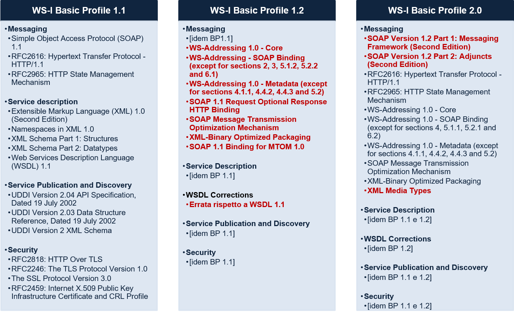
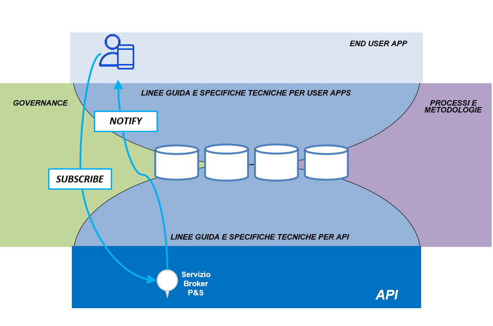

.. _sezione21:

Aspetti di interoperabilità
===========================

.. raw:: html

  

  

.. _sezione211:

Gli aspetti di interoperabilità all’interno del descrittore dell’ API
---------------------------------------------------------------------

Si riportano nella tabella seguente i campi del descrittore dell’API che indirizzano direttamente gli aspetti legati all’interoperabilità delle API.

.. list-table:: Campi del descrittore relativi agli aspetti di interoperabilità
   :align: center
   :header-rows: 1

   * - Fase del processo
     - Descrizione
   * - Tecnologia
     - Tecnologia di riferimento con la quale l’API è stata implementata.
   * - Interfaccia dell'API
     - Riferimento a uno o più file allegati al descrittore che documentano l'interfaccia dell’API  in modo completo per un utilizzatore. Per favorire l’interoperabilità all’interno dell’Ecosistema, il descrittore deve sempre contenere, in uno degli allegati, almeno un esempio di tracciato dati per ogni entità restituita. Tali documenti devono essere condivisi in formato editabile in modo che il Technical Management Board possa rimuovere gli endpoint dalla documentazione disponibile all’interno dell’ambiente di relazione. Tali endpoint non devono contenere indirizzi IP espliciti (es. 10.10.10.10) ma sempre nomi simbolici.
   * - Modello dei dati
     - Riferimento a uno o più file allegati al descrittore che documentano la struttura delle richieste e delle risposte in modo completo per un utilizzatore.
   * - Pattern di interazione
     - Paradigma di interazione con l'API. I valori ammissibili per questo attributo del descrittore sono:

          1. Request-response;
          2. Publish & subscribe;

Sono riportate nel seguito gli standard tecnologici e le relative linee guida per la gestione degli aspetti di interoperabilità delle API di E015 Digital Ecosystem.
In particolare, le API di E015 Digital Ecosystem possono essere realizzate secondo uno dei due seguenti standard tecnologici:

* SOAP (Simple Object Access Protocol);
* REST (REpresentational State Transfer).

.. _sezione212:

Stardard tecnologici e Linee Guida per l'interoperabilità
---------------------------------------------------------

.. _sezione2121:

Tecnologie per le API SOAP
^^^^^^^^^^^^^^^^^^^^^^^^^^

I Web Service SOAP rappresentano un meccanismo consolidato, condiviso e diffuso a supporto delle interazioni applicative ‘machine-to-machine’. 
La Web Services Interoperability Organization (WS-I, http://www.oasis-ws-i.org/), ha assunto il compito di definire **profili di interoperabilità** standard tra Web Service SOAP a diversi livelli. Ciascun profilo raccomanda un insieme “minimo” coerente di specifiche standard non proprietarie per promuovere e realizzare l’interoperabilità tra Web Service SOAP.
Tra i profili WS-I, il **WS-I Basic Profile** (BP) si occupa in particolare di normare le dimensioni tecnologiche basilari per l’interoperabilità tra Web Services  (la specifica dell’interfaccia, la rappresentazione del modello dei dati, i meccanismi di trasporto e scambio messaggi ecc.).
Esistono attualmente diverse versioni del WS-I Basic Profile (v1.0 errata: 25 ottobre 2005, v1.1 final: 10 aprile 2006, v1.2 e v2.0 final: 9 novembre 2010), le più recenti delle quali sono riassunte nella tabella che segue.
Per ciascuna versione del BP la tabella riassume le tecnologie citate, raggruppate per categoria, evidenziando le principali differenze e le novità rispetto alla versione precedente del profilo.

   Figura 2.2: Versioni del WS-I Basic Profile a confronto

**Il punto di riferimento iniziale a supporto dell’interoperabilità dei Web Services SOAP in E015 Digital Ecosystem è il WS-I Basic Profile versione 1.1.**

Inoltre, a corredo o a complemento delle diverse versioni del BP, la OASIS WS-I organization ha definito i seguenti profili:

* Simple SOAP Binding Profile (v1.0 final: 24 agosto 2004): indica requisiti specifici sulla serializzazione delle buste SOAP e la relativa rappresentazione nei messaggi di richiesta e risposta.

* Attachments Profile (v1.0 final: 20 aprile 2006): complementare al BP 1.1 relativamente all’uso di SOAP with Attachments. 

* Basic Security Profile (v1.0 final errata: 5 luglio 2010, v1.1 final: 24 gennaio 2010): Fornisce requisiti specifici per rappresentare e veicolare le informazioni di sicurezza legate a un Web API. Le considerazioni relative alla sicurezza dei API SOAP sono riportate nella :ref:`Sezione 2.2.4.1 <sezione2241>`.

Considerazioni sul modello dei dati
"""""""""""""""""""""""""""""""""""

La selezione congiunta di un sottoinsieme di tecnologie standard è un elemento abilitante per l’interoperabilità applicativa; tuttavia è necessario indirizzare altri aspetti legati all’interoperabilità e relativi alle modalità di utilizzo degli standard tecnologici selezionati.
Da questo punto di vista, il **modello dei dati** su cui si basano le interfacce delle API riveste un ruolo di particolare importanza. In generale, le specifiche dei Web API non entrano nel merito del modello dei dati di una API. Per garantire l’interoperabilità e la qualità delle API esposte in E015 Digital Ecosystem, in aggiunta alle specifiche tecniche, occorre introdurre opportune linee guida relative al modello dei dati e in generale all’interfaccia di una API.

**Uso di XLM Schema**

* È opportuno fare riferimento a tipi standard della specifica XML Schema anziché creare tipi “custom” (esempi: ‘xs:date’, ‘xs:duration’, ‘xs:gYear’);

* Si sconsiglia di utilizzare tipi generici (es. ‘xs:string’) per rappresentare dati strutturati;

* In caso di campi alfanumerici aventi una formattazione specifica, è opportuno restringere l’uso del tipo ‘xs:string’ utilizzando opportuni pattern (esempi: ‘CAP’, ‘codice fiscale’, ‘codice Istat comune’);

* Valutare sempre l’uso di tipi già definiti nei Glossari condivisi dell’Ecosistema (esempi: ‘visitatore’, ‘point of interest’, ‘evento’).

**WSDL(http://www.w3.org/TR/wsdl) e parametri di input e output**

* Si sconsiglia di utilizzare tipi “opachi” (per esempio in formato ‘base64binary’) nei parametri di input e output di una API: l’uso di tipi non opachi abilita controlli strutturali (validazione rispetto allo schema XML) che possono essere effettuati già a livello di interfaccia anziché essere rimandati a livello applicativo affidandoli alla logica interna di funzionamento del singolo API.

* Adottare sempre, quando possibile, il Document/Literal Style.

.. _sezione2122:

Tecnologie per le API REST
^^^^^^^^^^^^^^^^^^^^^^^^^^

Le API REST rappresentano una modalità alternativa per la pubblicazione e fruizione di API su protocollo HTTP rispetto a API di tipo SOAP. REST non impone particolari vincoli sulle tecnologie da adottare, per esempio relativamente alla descrizione dell’interfaccia o al modello dei dati. Tuttavia esistono alcune specifiche che possono essere utilizzate in ambito REST per coprire determinate dimensioni di interoperabilità (es. OpenAPI/Swagger per la descrizione dell’interfaccia di un API).

Le API REST pubblicate in E015 Digital Ecosystem devono essere accompagnate da una adeguata documentazione, in particolare per quanto riguarda:

 * Il modello e il formato dei dati;
 * Le operazioni fornite dalla API.

Il presente requisito può essere soddisfatto allegando una descrizione dell’API formulata mediante uno dei linguaggi di descrizione di API REST quali, ad esempio, OpenAPI 3.0, OpenAPI 2.0 (anche noto come Swagger 2.0). Il linguaggio di descrizione OpenAPI è attualmente supportato dal consorzio Open API Initative (https://www.openapis.org/).
In alternativa, per il modello dei dati delle API REST si richiede di utilizzare in particolare:

* XML Schema (http://www.w3.org/XML/Schema) per i dati in formato XML;
* JSON Schema (http://json-schema.org/) per i dati in formato JSON.

Per la pubblicazione e il discovery di API REST si può fare riferimento agli standard Atom (http://www.ietf.org/rfc/rfc4287.txt). Per realizzare la sicurezza di canale è opportuno utilizzare sempre il protocollo HTTPS. Per ulteriori considerazioni relative alla sicurezza dei API REST si veda la :ref:`Sezione 2.2.4.2 <sezione2242>`.

.. _sezione2123:

Tecnologie per le API Publish/Subscribe
^^^^^^^^^^^^^^^^^^^^^^^^^^^^^^^^^^^^^^^

E015 Digital Ecosystem intende supportare scenari in cui da una parte vi sono soggetti, per esempio le API, che pubblicano notifiche (notify) e dall’altra vi sono altri soggetti, per esempio le applicazioni, che sono interessati a ricevere notifiche per erogare le proprie funzionalità (subscribe).

   Figura 2.3: Approccio al publish/subscribe nell'Ecosistema

Nell’ambito dell’Ecosistema è possibile adottare i seguenti due approcci (non mutuamente esclusivi) al Publish/Subscribe:

* Notification Dispatcher pubblicato dal singolo API Provider: in questo caso è il singolo provider dell’API a implementare internamente la logica di subscribe e notify necessaria a supportare il funzionamento della propria API (es. propagazione di informazioni ai soggetti interessati);

* Broker Publish/Subscribe esposto da un API Provider: in questo caso l’API di sottoscrizione e notifica è fornita come API trasversale erogata da un provider di E015 Digital Ecosystem e messa a disposizione di altri soggetti. Per esempio, può trattarsi di API di notifica dedicate destinate a domini verticali o specifiche categorie di eventi.

La tecnologia di riferimento è WS-Notification (http://www.oasis-open.org/committees/wsn/), attuale specifica di riferimento in ambito Web Service SOAP.
Nel caso in cui si intendesse pubblicare all’interno dell’Ecosistema una API di tipo Publish/Subscribe è necessario assegnare all’attributo “Pattern di interazione” del descrittore dell’API il valore **Publish&Subscribe**.
Qualora invece si intendesse pubblicare una API sincrona di tipo request-response è necessario assegnare all’attributo “Pattern di interazione” del descrittore del API il valore **Request-Response**.

